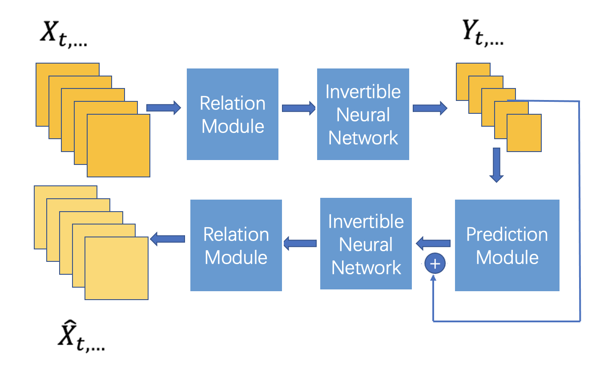
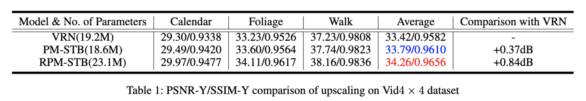

# Video Rescaling Network – Optimized with Swin Transformer & Relation Module
Pytorch Implementation of our project "Video Rescaling Network – Optimized with Swin Transformer & Relation Modulel".

Refer to "Video Rescaling Networks with Joint Optimization Strategies for Downscaling and Upscaling", which is our base model.

VRN Project Page: [Link](https://ding3820.github.io/MIMO-VRN/)

VRN Paper (arXiv): [Link](https://arxiv.org/abs/2103.14858)


## Prerequisite
- Python 3 via Anaconda (recommended)
- PyTorch >= 1.4.0
- NVIDIA GPU + CUDA
- Python Package: `pip install numpy opencv-python lmdb pyyaml`

## Dataset Preparation
Training and testing dataset can be found [here](http://toflow.csail.mit.edu/). 
We adopt the LMDB format and also provide the script in `codes/data_scripts`. 
For more detail, please refer to [BasicSR](https://github.com/xinntao/BasicSR).

## Usage
All the implementation is in `/codes`. To run the code, 
select the corresponding configuration file in `/codes/options/` and run as following command (MIMO-VRN for example):
#### Training
```
python train.py -opt options/train/train.yml
python train.py -opt options/train/train_MIMO-VRN.yml
```
#### Testing
```
python testrec.py -opt options/test/test.yml
python test.py -opt options/test/test_MIMO-VRN.yml
```

## Frames


## Quantitative Results 
#### HR Reconstruction on Vid4


## Acknowledgement
Our project is heavily based on [Video Rescaling Networks with Joint Optimization Strategies for Downscaling and Upscaling](https://ding3820.github.io/MIMO-VRN/) 
